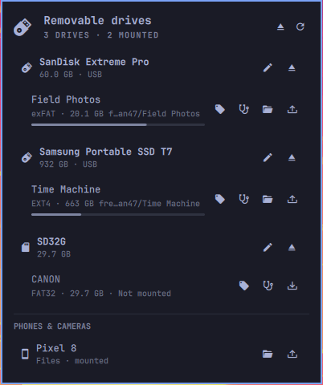

# Removable Drives

USB sticks, SD cards, phones, and external drives in the Omarchy bar — mount,
open, and safely eject them without a terminal.



The icon only exists while a drive does. Plug one in and it appears; pull it out
and the bar goes back to what it was.

## What it does

- **Appears only when it is needed.** No drive attached, no icon in the bar.
- **Mount and unmount** any removable volume, without a password — udisks2
  already allows the logged-in session to do this.
- **Open in your file manager**, either on click or automatically after
  mounting.
- **Eject properly**: unmounts every volume on the drive, re-locks anything
  encrypted, then powers the device down so it is genuinely safe to pull.
- **Knows when the drive is still being written to.** The bar icon turns urgent
  while the kernel has I/O in flight, and the panel shows the live rate. A copy
  dialog reaching 100% is not the moment a stick is safe to pull; the kernel's
  own counters in `/sys/block/<dev>/stat` are.
- **An eject asked for mid-copy is held, not refused.** It fires by itself once
  the drive has been quiet for two consecutive seconds, and can be called off
  until then.
- **Says who is holding a busy mount.** udisks reports `target is busy` and
  stops there; this asks `fuser` and names the processes, then offers a lazy
  unmount as an explicit second choice.
- **Announces drives** as they are plugged in, and warns loudly when one is
  unplugged while a filesystem is still mounted.
- **Eject all** in one action, for packing up.
- **Phones and cameras** appear in their own section, mounted over MTP through
  gvfs, so an Android phone is one click from the file manager.
- **Name your drives.** A nickname is stored against the drive's serial, so it
  follows the hardware rather than whichever `/dev/sdb` it landed on today.
- **Run a command when a drive appears** — a backup, an import, a sync — set
  per drive in the state file, never inferred.
- **Empties the trash you cannot see.** Deleted files on removable media go to
  a `.Trash-1000` on the drive itself; the panel shows its size and clears it.
- **Optional bar text**: free space, the drive's name, or how many are
  attached.
- **Free space at a glance**, with a usage bar that turns urgent past 90%.
- **Reacts instantly.** A `udevadm` event stream means the panel updates the
  moment a drive appears, rather than up to a poll interval later.
- **Encrypted volumes** are shown with a lock. Unlocking opens a terminal so
  the passphrase is typed into `udisksctl` rather than into a bar popup.
- **Never offers to eject the disk you booted from.** A USB-booted or
  Thunderbolt-attached system disk reports itself as removable just like a
  thumb drive; any disk holding `/`, `/boot`, `/home`, and friends is left out
  of the list entirely.

## Install

```bash
omarchy plugin add https://github.com/Wian47/omarchy-removable-drives.git --enable
```

Or by hand:

```bash
git clone https://github.com/Wian47/omarchy-removable-drives.git \
  ~/.config/omarchy/plugins/wian47.removable-drives
omarchy-shell shell rescanPlugins
omarchy plugin enable wian47.removable-drives --section right
```

Requires Omarchy 4 (Quattro) and a running `udisks2` — both are standard on
Omarchy.

### Phones and cameras

A phone appears only if gvfs has a backend that speaks its protocol. Omarchy
ships `gvfs-mtp`, so **Android works out of the box**. Apple devices speak AFC
instead, which needs two more packages:

```bash
sudo pacman -S --needed usbmuxd gvfs-afc gvfs-gphoto2
```

A plugin cannot install these for you — Omarchy's plugin installer never runs
sudo or install hooks, by design. So when something is plugged in that gvfs
cannot reach, the panel says which packages are missing and offers to open
Omarchy's own installer, rather than showing an empty section and letting you
wonder whether the widget is broken.

A trusted iPhone shows up as **two** entries, because iOS exposes two
different things: `Documents on <device>` over AFC (the document folder of
each app that opts into File Sharing) and the device name over PTP (the camera
roll). The panel labels them `Files` and `Photos` accordingly.

Apple restricts both: AFC is not a general filesystem, and PTP only sees
photos that are physically on the device — with iCloud Photos set to "Optimize
iPhone Storage", the originals live in iCloud and the camera roll can read as
empty. The device must be unlocked and have trusted this computer.

Browsing uses `gio open` rather than `xdg-open`, because nothing registers an
`x-scheme-handler` for `gphoto2://`, `afc://`, or `mtp://` — `xdg-open` exits
successfully and does nothing at all with them.

### Removing it

```bash
omarchy plugin disable wian47.removable-drives   # keep it installed, off the bar
omarchy plugin remove wian47.removable-drives    # remove it entirely
```

Removing the plugin leaves nothing behind except its own settings file, which
you can delete if you want the nicknames gone too:

```bash
rm ~/.local/state/omarchy/removable-drives.json
```

It never writes to `shell.json`, your Hyprland config, or anything else of
yours — the bar entry is managed by Omarchy's own plugin commands, and the
nicknames live in the file above.

## Requirements

Everything below `udisks2` ships with Omarchy; the widget calls these and
nothing else.

| Used for | Commands |
|---|---|
| Listing and watching drives | `lsblk`, `udevadm`, `stdbuf` |
| Mounting, ejecting, unlocking | `udisksctl` (udisks2) |
| Phones and cameras | `gio` (gvfs) |
| Write activity | `/sys/block/<dev>/stat` via `head` |
| Busy mounts, trash, clipboard | `fuser`, `ps`, `du`, `rm`, `wl-copy` |
| Notifications and terminals | `omarchy-notification-send`, `omarchy-launch-floating-terminal-with-presentation`, `omarchy-install-app` |

Nothing runs as root, and the only recursive delete is emptying a drive's own
trash, guarded as described below.

## Using it

| Where | Action |
|---|---|
| Bar icon | left = open panel · right = rescan · middle = open the first mounted volume |
| Volume row | click = mount (and open), or open if already mounted |
| 󰄠 / 󰄝 | mount / unmount that volume |
| 󰝰 | open that volume in the file manager |
| ⏏ | eject the whole drive (or cancel a deferred eject) |
| ⏏ in the header | eject every attached drive |
| ✏ | rename the drive (a nickname that sticks to the hardware) |
| Middle-click a volume | copy its mount path |
| Phone row | click = mount, or browse if already mounted |

Keyboard, while the panel is open:

| Key | Action |
|---|---|
| `j` / `k` or ↑ / ↓ | move between drives and volumes |
| `Enter` / `Space` | mount and open a volume, or eject a drive |
| `m` | mount or unmount the selected volume |
| `o` | open the selected volume |
| `e` or `x` | eject the selected drive |
| `E` | eject every drive |
| `t` | open a terminal at the selected volume |
| `y` | copy the selected volume's path |
| `n` | rename the selected drive |
| `r` | rescan |
| `Esc` | close |

## Settings

Set these on the widget's entry in `~/.config/omarchy/shell.json`, or through
Setup > Plugins.

| Key | Default | What it does |
|---|---|---|
| `alwaysShow` | `false` | Keep the icon in the bar even with nothing attached |
| `openOnMount` | `true` | Open the file manager once a volume finishes mounting |
| `notifications` | `true` | Announce drives on connect, and warn when one is pulled while mounted |
| `fileManager` | `""` | Command used to open a mount point; empty means `xdg-open` |
| `barLabel` | `"none"` | Text beside the icon: `none`, `free`, `name`, or `count`. Vertical bars stay icon-only. |
| `refreshIntervalSec` | `8` | How often free space is re-read *while the panel is open*. Drives are still detected instantly either way. |

```json
{ "id": "wian47.removable-drives", "openOnMount": false, "fileManager": "nautilus" }
```

## Scripting

The widget registers a `removable-drives` IPC target, so a keybind or script
can drive it:

```bash
omarchy-shell removable-drives toggle
omarchy-shell removable-drives list            # every drive and volume, as JSON
omarchy-shell removable-drives eject /dev/sdb  # unmount, lock, power off
omarchy-shell removable-drives ejectAll
omarchy-shell removable-drives status          # {"devices":1,"busy":false,...}
omarchy-shell removable-drives refresh
omarchy-shell removable-drives phones             # phones/cameras, as JSON
omarchy-shell removable-drives rename /dev/sdb "Work backup"   # "" clears it
```

`status` reports `busy: true` while the kernel still has I/O in flight, so a
backup script can wait for the drive to settle before telling someone to pull
it. Both eject calls wait for pending writes by themselves.

## Per-drive settings

Nicknames live in `~/.local/state/omarchy/removable-drives.json`, keyed by the
drive's serial so they survive replugging. The file is watched, so editing it
by hand takes effect immediately — which is also how you attach a command to a
drive:

```json
{
  "version": 1,
  "drives": {
    "serial:0901f8ef1ed9c144": {
      "nickname": "Work backup",
      "onConnect": "rsync -a ~/Documents/ \"$2\"/documents/"
    }
  }
}
```

`onConnect` runs through `bash -c` when that specific drive appears, with `$1`
set to its device path and `$2` to its first mount point. Nothing writes this
for you and nothing suggests it — it runs only what you put there yourself.

## How it works

| File | Role |
|---|---|
| `Panel.qml` | Bar icon and popup: rows, keyboard cursor, actions |
| `Service.qml` | Everything that touches the system: `lsblk`, `udevadm`, `udisksctl` |
| `Model.js` | Pure parsing, formatting, I/O-activity maths, and the trash-path guard — no QML, no processes |
| `test/model.test.js` | Tests for the parsing rules, runnable without a compositor |

Emptying a drive's trash is the one recursive delete here, so the path is
re-derived from the live mount list and must match a `.Trash-<uid>` candidate
of a currently-mounted removable volume exactly — no prefix matching, no
globbing. `test/model.test.js` asserts it refuses `/`, `$HOME`, the mount root
itself, and paths on drives it is not tracking.

Nothing runs as root and nothing is installed system-wide. Mounting a removable
filesystem is `allow_active: yes` in the stock udisks2 policy, which is why no
password is asked for; anything needing more than that is handed to a terminal.

```bash
node test/model.test.js       # 60 tests, no compositor required
omarchy plugin validate .     # manifest check the shell itself would apply
```

## License

MIT
